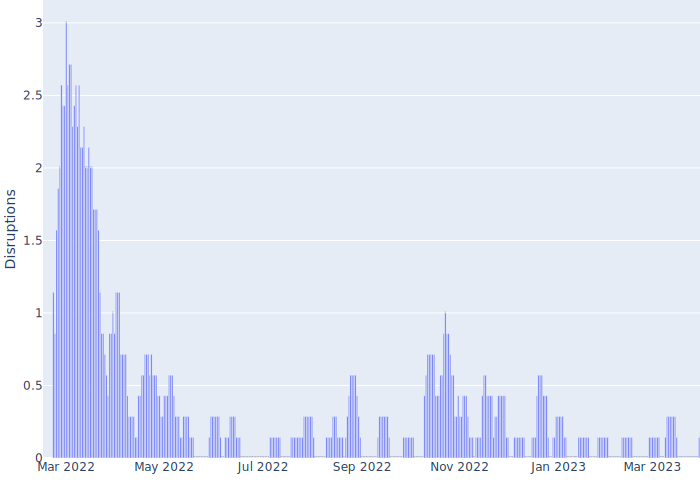
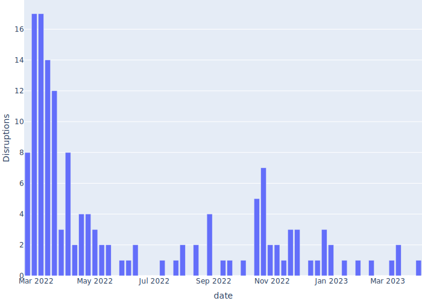

# NetBlocks analysis

Number of mentions of "Ukraine" in NetBlocks tweets, over time. For more
information about NetBlocks, see [netblocks.org](https://netblocks.org/).

Based on twitter scraping, search term:
`Ukraine (from:netblocks) -filter:replies`

This is a very naive and simplified analysis, using each time the @NetBlocks
twitter account tweeted about Ukraine as one evidence of an outage. Not taking
into account regional differences or actual textual content of tweets.

See [netblocks_analysis.ipynb](netblocks_analysis.ipynb)

7 day rolling mean of disruptions:

Weekly disruptions:

